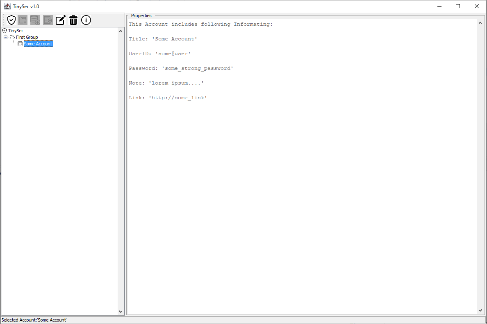

# TinySec

TinySec is a small offline password manager that stores accounts and notes encrypted on your local disk using a master password.  

This tool started as a personal project and has been in daily use for more than 20 years. I’m making it public in case others find it useful.

---

## Screenshot

  
A simple offline password manager (Java Swing)

---

## Features

- Desktop GUI application (Java Swing)  
- Stores passwords and secure notes  
- Local encrypted storage on disk  
- Master password protection  
- Fully offline, no telemetry  
- No tracking

---

## Security & Transparency

TinySec is designed as a simple, local password manager.

- All data is stored locally on your machine  
- No internet connection is required or used  
- No data is transmitted anywhere  
- Access is protected via a master password  
- Data is encrypted before being written to disk

**Important:**  
This software has not been security-audited. It was built for personal use and is shared as-is.  
Do not rely on it for high-risk environments or critical infrastructure.

---

## Project Status

TinySec is feature-complete and not actively developed.  

- Bug fixes may happen, but no roadmap is planned  
- Consider the project stable and maintained in a minimal way

---

## Download

You can download the latest version from the [Releases](https://github.com/ganym3dgm/tinysec/releases) section:  

`TinySec.jar`

---

## License

This project is released under the MIT License.  

It is provided **“as is”**, without warranty of any kind. Use at your own risk.  

See the LICENSE file for details.

---

## Donations

If TinySec is useful to you and you'd like to support it:  

https://www.paypal.com/donate/?hosted_button_id=5KM4X9PDQSE7J

Donations are completely optional and help keep the project available.
